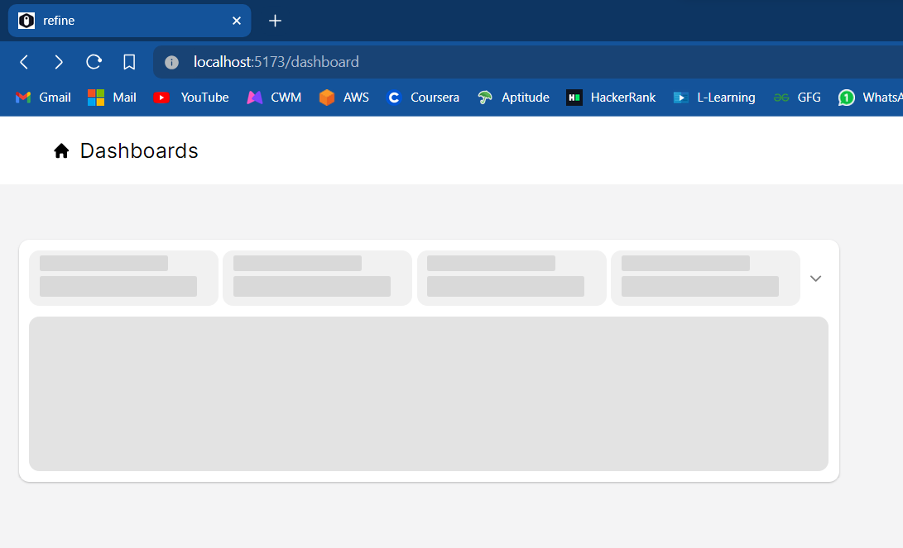
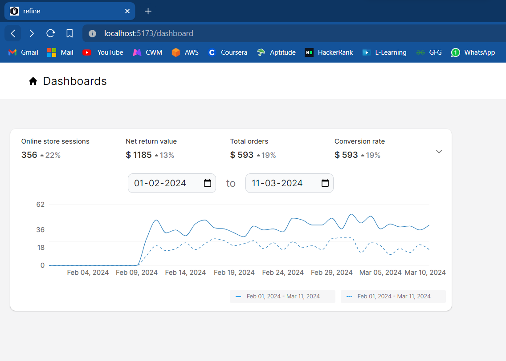
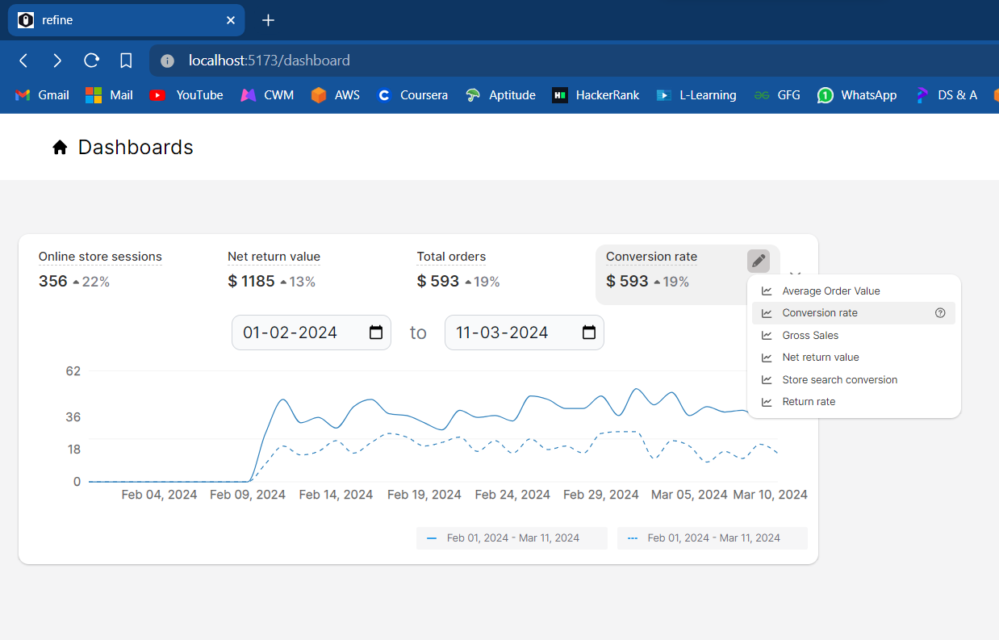
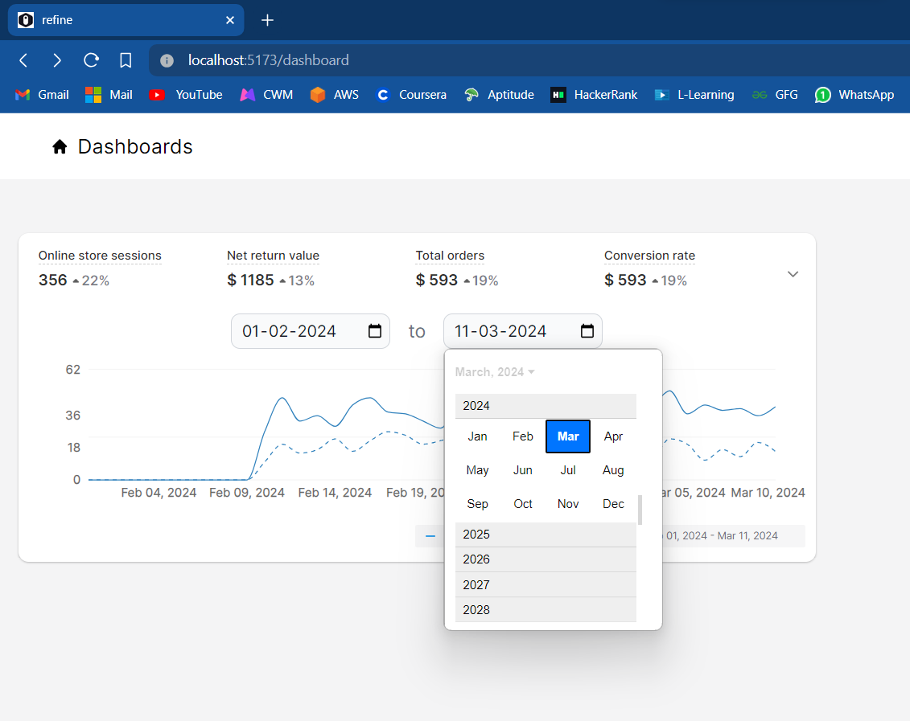
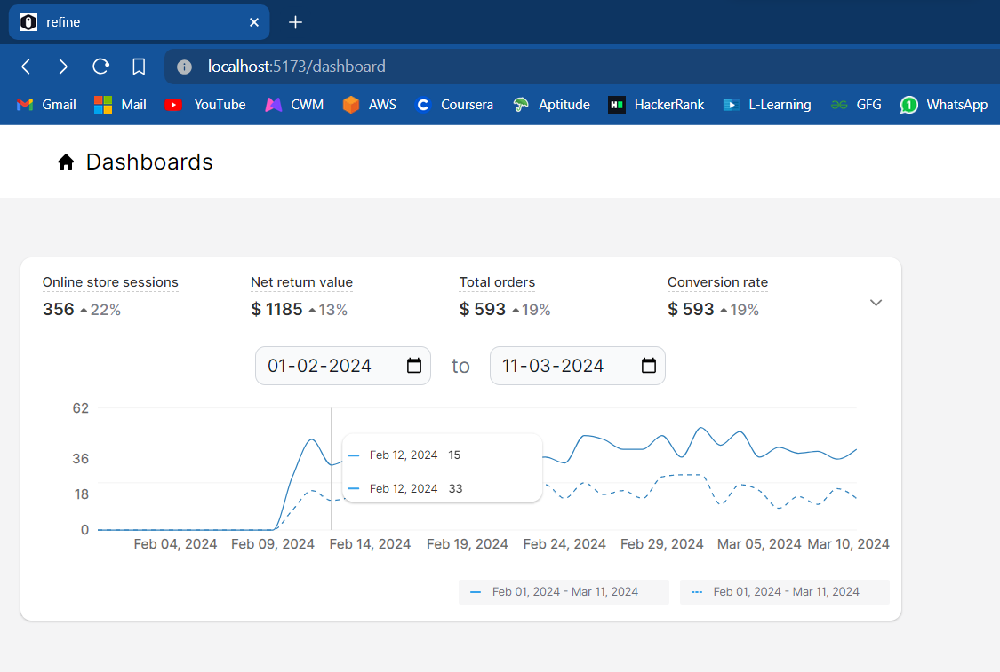

**React Dashboard with Refine and Recharts**
This is a React dashboard component that utilizes Refine for data fetching and management, and Recharts for building charts.

**Installation**
Clone or download this repository.

Install dependencies using npm or yarn:

> Bash

```
npm install
```

To run the application in development use

> Bash

```
npm run dev
```

**Screenshots**





